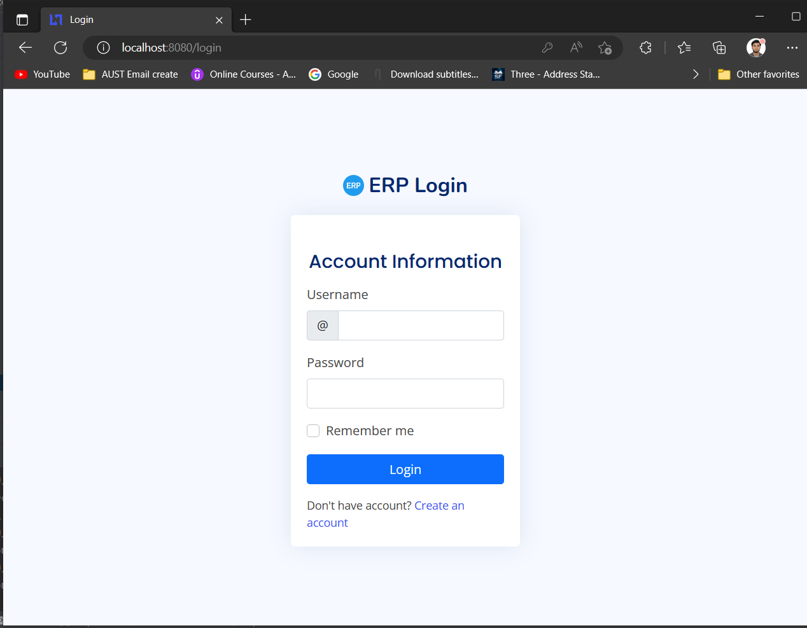
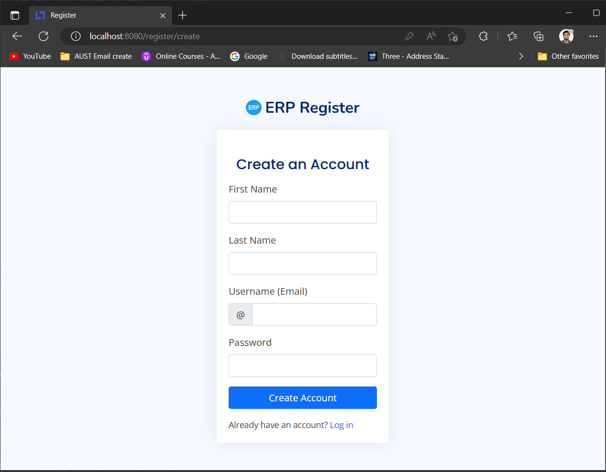
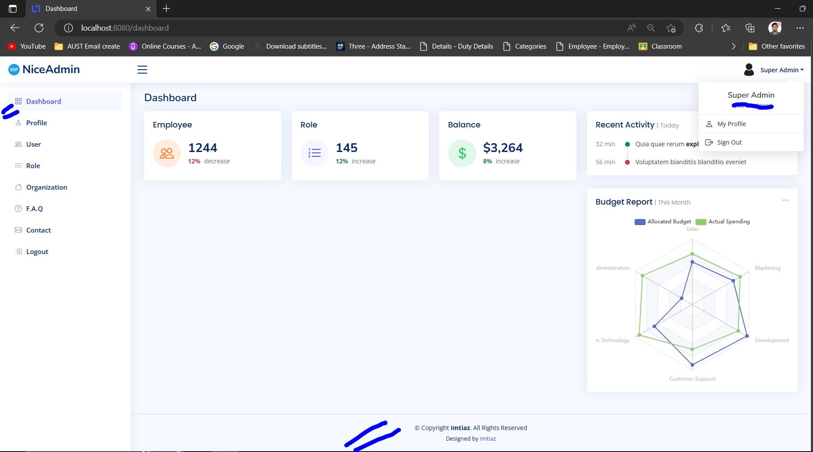

# ERP - Java Trainees 2023

Project for Trainees
deployed on [Railway](https://erp-production-bf6c.up.railway.app/)
## Client Requirement
As a Guest user, I can
- view homepage
- Sign Up to be an employee with minimal information

As an Admin user, I can
- Log in
- VIEW & EDIT my profile info (first name, last name...)
- CRUD Users
- CRUD Roles (Only 2 Roles: ADMIN, Employee)
- CRUD Organizations
- CRUD Employees
- Log out

As an Employee user, I can
- Log in
- VIEW & EDIT my profile info (first name, last name...)
- VIEW My Account Balance
- VIEW Organizations
- Log out

## Technology
* Language: Java 17
* Build Tool: Gradle
* Spring Boot: 2.7.10
* Database: H2

## Features
- [ ] Server-Side (using Template Engine)
   - [ ] /login ()
   - [ ] /users
   - [ ] /roles
   - [ ] /organizations
   - [ ] /employees
- [ ] REST API
   - [ ] /api/login (JWT)
   - [ ] /api/signup (public)
   - [ ] /api/users (secured, authorized to ADMIN only)
   - [ ] /api/roles (secured, authorized to ADMIN only)
   - [X] /api/organization (secured, authorized to ADMIN for CRUD, VIEW for EMPLOYEE)
- [x] API Doc: Swagger
- [x] Mapper: Mapstruct
- [x] Code Formatter: Spotless
- [ ] Apply Spring Security
- [ ] Global Exception Handler
- [ ] Implement JPA Auditing
- [ ] Write Unit Test
- [ ] Setup different database driver in different profile
- [ ] Upgrade to Spring Boot 3
- [ ] Deployment (profile: develop)
- [ ] Update Documentation (README.md)

## How to Build & Run
1. Install Java 17 (LTS) of any distribution. You can try Amazon Corretto 17. You can find the installation instruction here: https://docs.aws.amazon.com/corretto/latest/corretto-17-ug/what-is-corretto-17.html

2. Open this project with your preferred IDE. We prefer IntelliJ IDEA Ultimate Edition. Others IDE like VS Code or Spring Tools Suite (STS) will do.

3. Wait until it loads the project. 
4. To build the project execute the following command:
    ```
    ./gradlew clean build
    ```
    Executing that command will generate a jar under "build/libs" folder which you can run using following command:
    ```
    java -jar erp-0.0.1-SNAPSHOT.jar
    ```
    or, You can run the app directly by following command:
    ```
    ./gradlew bootRun
    ```
   or, you can run via your preferred IDE's RUN/PLAY button.
5. After running the application, it will be up & running at: http://localhost:8080
6. You can also access the Swagger API Doc by going to: http://localhost:8080/swagger-ui/index.html# . Feel free to execute the Organization's REST APIs which I prepared for you guys to play with.


<p align="center">
<h1>Output</h1>
<hr>

## Homepage


## Login Page



## Register Page


## Dashboard


Top


Bottom


## Profile

## User CRUD

## Role CRUD